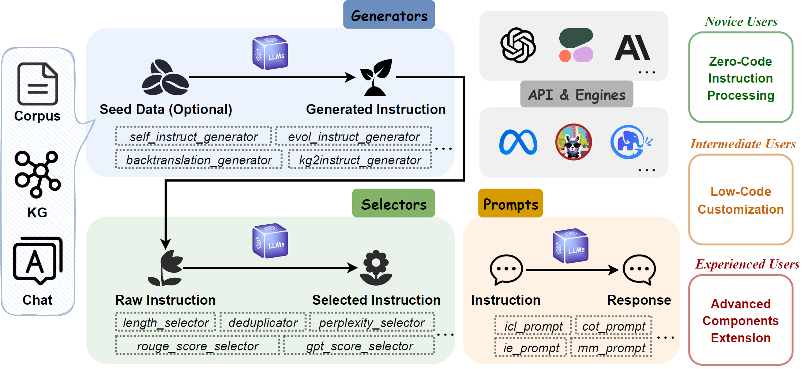
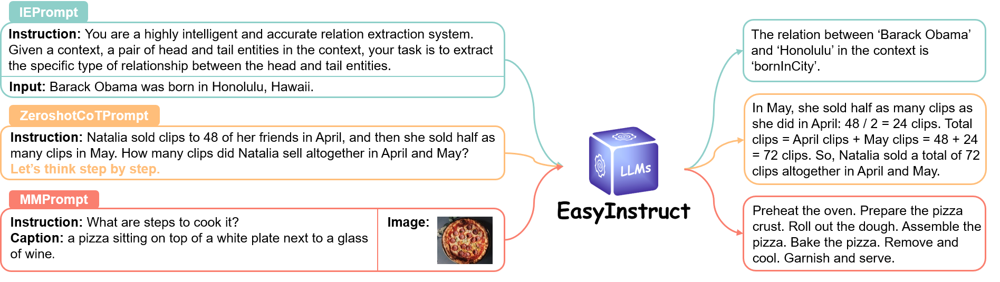

<div align="center">


**An Easy-to-use Instruction Processing Framework for Large Language Models.**

---

<p align="center">
  <a href="https://zjunlp.github.io/project/EasyInstruct">Project</a> •
  <a href="https://arxiv.org/abs/2402.03049">Paper</a> •
  <a href="https://huggingface.co/spaces/zjunlp/EasyInstruct">Demo</a> •
  <a href="#overview">Overview</a> •
  <a href="#installation">Installation</a> •
  <a href="#quickstart">Quickstart</a> •
  <a href="#use-easyinstruct">How To Use</a> •
  <a href="https://zjunlp.gitbook.io/easyinstruct/">Docs</a> •
  <a href="#citation">Citation</a> •
  <a href="#contributors">Contributors</a>
</p>


[](https://opensource.org/licenses/MIT)
 
 

</div>

## Table of Contents

- <a href="#news">What's New</a>
- <a href="#overview">Overview</a>
- <a href="#installation">Installation</a>
- <a href="#quickstart">Quickstart</a>
  - <a href="#shell-script">Shell Script</a>
  - <a href="#gradio-app">Gradio App</a>
- <a href="#use-easyinstruct">Use EasyInstruct</a>
  - <a href="#generators">Generators</a>
  - <a href="#selectors">Selectors</a>
  - <a href="#prompts">Prompts</a>
  - <a href="#engines">Engines</a>
- <a href="#citation">Citation</a>
- <a href="#contributors">Contributors</a>

## 🔔News

- **2024-2-6 We release the paper "[EasyInstruct: An Easy-to-use Instruction Processing Framework for Large Language Models](https://arxiv.org/abs/2402.03049)".**
- **2024-2-5 We release version 0.1.2, supporting for new features and optimising the function interface.**
- **2023-12-9 The paper "[When Do Program-of-Thoughts Work for Reasoning?](https://arxiv.org/abs/2308.15452)" (supported by EasyInstruct), is accepted by AAAI 2024!**
- **2023-10-28 We release version 0.1.1, supporting for new features of instruction generation and instruction selection.**
- **2023-8-9 We release version 0.0.6, supporting Cohere API calls.**
- **2023-7-12 We release [EasyEdit](https://github.com/zjunlp/EasyEdit), an easy-to-use framework to edit Large Language Models.**
<details>
<summary><b>Previous news</b></summary>

- **2023-5-23 We release version 0.0.5, removing requirement of llama-cpp-python.**
- **2023-5-16 We release version 0.0.4, fixing some problems.**
- **2023-4-21 We release version 0.0.3, check out our [documentations](https://zjunlp.gitbook.io/easyinstruct/documentations) for more details.**
- **2023-3-25 We release version 0.0.2, suporting IndexPrompt, MMPrompt, IEPrompt and more LLMs**
- **2023-3-13 We release version 0.0.1, supporting in-context learning, chain-of-thought with ChatGPT.**
  
</details>

---

This repository is a subproject of [KnowLM](https://github.com/zjunlp/KnowLM).


## 🌟Overview

EasyInstruct is a Python package which is proposed as an easy-to-use instruction processing framework for Large Language Models(LLMs) like GPT-4, LLaMA, ChatGLM in your research experiments. EasyInstruct modularizes instruction generation, selection, and prompting, while also considering their combination and interaction. 



- The current supported instruction generation techniques are as follows:

  | **Methods** | **Description** |
  | --- | --- |
  | [Self-Instruct](https://arxiv.org/abs/2212.10560) | The method that randomly samples a few instructions from a human-annotated seed tasks pool as demonstrations and prompts an LLM to generate more instructions and corresponding input-output pairs. |
  | [Evol-Instruct](https://arxiv.org/abs/2304.12244) | The method that incrementally upgrades an initial set of instructions into more complex instructions by prompting an LLM with specific prompts. |
  | [Backtranslation](https://arxiv.org/abs/2308.06259) | The method that creates an instruction following training instance by predicting an instruction that would be correctly answered by a portion of a document of the corpus.  |
  | [KG2Instruct](https://arxiv.org/abs/2305.11527) | The method that creates an instruction following training instance by predicting an instruction that would be correctly answered by a portion of a document of the corpus. |

- The current supported instruction selection metrics are as follows:

  | **Metrics** | **Notation** | **Description**                                                                                                             |
  |----------------------|-----------------------|--------------------------------------------------------------------------------------------------------------------------------------|
  | Length               | $Len$                 | The bounded length of every pair of instruction and response.                                                                                 |
  | Perplexity           | $PPL$                 | The exponentiated average negative log-likelihood of response.                                                                       |
  | MTLD                 | $MTLD$                | Measure of textual lexical diversity, the mean length of sequential words in a text that maintains a minimum threshold TTR score.                                                                                   |
  | ROUGE                | $ROUGE$               | Recall-Oriented Understudy for Gisting Evaluation, a set of metrics used for evaluating similarities between sentences.                                                                                   |
  | GPT score            | $GPT$                 | The score of whether the output is a good example of how AI Assistant should respond to the user's instruction, provided by ChatGPT. |
  | CIRS                 | $CIRS$                | The score using the abstract syntax tree to encode structural and logical attributes, to measure the correlation between code and reasoning abilities.                                                                                   |

- API service providers and their corresponding LLM products that are currently available:
  
   **Model** | **Description**                                                                                                                  | **Default Version** 
  --------------------|-------------------------------------------------------------------------------------------------------------------------------------------|------------------------------
  ***OpenAI***
   GPT-3.5            | A set of models that improve on GPT-3 and can understand as well as generate natural language or code.                                    | `gpt-3.5-turbo`       
   GPT-4              | A set of models that improve on GPT-3.5 and can understand as well as generate natural language or code.                                  | `gpt-4`
   ***Anthropic***               
   Claude             | A next-generation AI assistant based on Anthropic’s research into training helpful, honest, and harmless AI systems.                      | `claude-2.0`          
   Claude-Instant     | A lighter, less expensive, and much faster option than Claude.                                                                            | `claude-instant-1.2`
  ***Cohere***     
   Command            | A flagship text generation model of Cohere trained to follow user commands and to be instantly useful in practical business applications. | `command`             
   Command-Light      | A light version of Command models that are faster but may produce lower-quality generated text.                                           | `command-light`    
---

## 🔧Installation

**Installation from git repo branch:**
```
pip install git+https://github.com/zjunlp/EasyInstruct@main
```

**Installation for local development:**
```
git clone https://github.com/zjunlp/EasyInstruct
cd EasyInstruct
pip install -e .
```

**Installation using PyPI (not the latest version):**
```
pip install easyinstruct -i https://pypi.org/simple
```

---

## ⏩Quickstart

We provide two ways for users to quickly get started with EasyInstruct. You can either use the shell script or the Gradio app based on your specific needs.

### Shell Script

#### Step1: Prepare a configuration file

Users can easily configure the parameters of EasyInstruct in a YAML-style file or just quickly use the default parameters in the configuration files we provide. Following is an example of the configuration file for Self-Instruct:

```yaml
generator:
  SelfInstructGenerator:
    target_dir: data/generations/
    data_format: alpaca
    seed_tasks_path: data/seed_tasks.jsonl
    generated_instructions_path: generated_instructions.jsonl
    generated_instances_path: generated_instances.jsonl
    num_instructions_to_generate: 100
    engine: gpt-3.5-turbo
    num_prompt_instructions: 8
```

More example configuration files can be found at [configs](https://github.com/zjunlp/EasyInstruct/tree/main/configs).

#### Step2: Run the shell script

Users should first specify the configuration file and provide their own OpenAI API key. Then, run the following shell script to launch the instruction generation or selection process.

```shell
config_file=""
openai_api_key=""

python demo/run.py \
    --config  $config_file\
    --openai_api_key $openai_api_key \
```

### Gradio App

We provide a Gradio app for users to quickly get started with EasyInstruct. You can run the following command to launch the Gradio app locally on the port `7860` (if available).

```shell
python demo/app.py
```

We also host a running gradio app in HuggingFace Spaces. You can try it out [here](https://huggingface.co/spaces/zjunlp/EasyInstruct).

---

## 📌Use EasyInstruct

Please refer to our [documentations](https://zjunlp.gitbook.io/easyinstruct/documentations) for more details.

### Generators

The `Generators` module streamlines the process of instruction data generation, allowing for the generation of instruction data based on seed data. You can choose the appropriate generator based on your specific needs.

#### BaseGenerator

> `BaseGenerator` is the base class for all generators.

> You can also easily inherit this base class to customize your own generator class. Just override the `__init__` and `generate` method.

#### SelfInstructGenerator

> `SelfInstructGenerator` is the class for the instruction generation method of Self-Instruct. See [Self-Instruct: Aligning Language Model with Self Generated Instructions](http://arxiv.org/abs/2212.10560) for more details.

<b>Example</b>

```python
from easyinstruct import SelfInstructGenerator
from easyinstruct.utils.api import set_openai_key

# Step1: Set your own API-KEY
set_openai_key("YOUR-KEY")

# Step2: Declare a generator class
generator = SelfInstructGenerator(num_instructions_to_generate=10)

# Step3: Generate self-instruct data
generator.generate()
```

#### BacktranslationGenerator

> `BacktranslationGenerator` is the class for the instruction generation method of Instruction Backtranslation. See [Self-Alignment with Instruction Backtranslation](http://arxiv.org/abs/2308.06259) for more details.

<details>
<summary><b>Example</b></summary>

```python
from easyinstruct import BacktranslationGenerator
from easyinstruct.utils.api import set_openai_key

# Step1: Set your own API-KEY
set_openai_key("YOUR-KEY")

# Step2: Declare a generator class
generator = BacktranslationGenerator(num_instructions_to_generate=10)

# Step3: Generate backtranslation data
generator.generate()
```

</details>

#### EvolInstructGenerator

> `EvolInstructGenerator` is the class for the instruction generation method of EvolInstruct. See [WizardLM: Empowering Large Language Models to Follow Complex Instructions](http://arxiv.org/abs/2304.12244) for more details.

<details>
<summary><b>Example</b></summary>

```python
from easyinstruct import EvolInstructGenerator
from easyinstruct.utils.api import set_openai_key

# Step1: Set your own API-KEY
set_openai_key("YOUR-KEY")

# Step2: Declare a generator class
generator = EvolInstructGenerator(num_instructions_to_generate=10)

# Step3: Generate evolution data
generator.generate()
```

</details>

#### KG2InstructGenerator

> `KG2InstructGenerator` is the class for the instruction generation method of KG2Instruct. See [InstructIE: A Chinese Instruction-based Information Extraction Dataset](https://arxiv.org/abs/2305.11527) for more details.

### Selectors

The `Selectors` module standardizes the instruction selection process, enabling the extraction of high-quality instruction datasets from raw, unprocessed instruction data. The raw data can be sourced from publicly available instruction datasets or generated by the framework itself. You can choose the appropriate selector based on your specific needs.

#### BaseSelector

> `BaseSelector` is the base class for all selectors.

> You can also easily inherit this base class to customize your own selector class. Just override the `__init__` and `__process__` method.

#### Deduplicator

> `Deduplicator` is the class for eliminating duplicate instruction samples that could adversely affect both pre-training stability and the performance of LLMs. `Deduplicator` can also enables efficient use and optimization of storage space.

#### LengthSelector

> `LengthSelector` is the class for selecting instruction samples based on the length of the instruction. Instructions that are too long or too short can affect data quality and are not conducive to instruction tuning.

#### RougeSelector

> `RougeSelector` is the class for selecting instruction samples based on the ROUGE metric which is often used for evaluating the quality of automated generation of text.

#### GPTScoreSelector

> `GPTScoreSelector` is the class for selecting instruction samples based on the GPT score, which reflects whether the output is a good example of how AI Assistant should respond to the user's instruction, provided by ChatGPT.

#### PPLSelector

> `PPLSelector` is the class for selecting instruction samples based on the perplexity, which is the exponentiated average negative log-likelihood of response.

#### MTLDSelector

> `MTLDSelector` is the class for selecting instruction samples based on the MTLD, which is short for Measure of Textual Lexical Diversity.

#### CodeSelector

> `CodeSelector` is the class for selecting code instruction samples based on the Complexity-Impacted Reasoning Score (CIRS), which combines structural and logical attributes, to measure the correlation between code and reasoning abilities. See [When Do Program-of-Thoughts Work for Reasoning?](https://arxiv.org/abs/2308.15452) for more details.

<details>
<summary><b>Example</b></summary>

```python
from easyinstruct import CodeSelector

# Step1: Specify your source file of code instructions
src_file = "data/code_example.json"

# Step2: Declare a code selecter class
selector = CodeSelector(
    source_file_path=src_file, 
    target_dir="data/selections/",
    manually_partion_data=True,
    min_boundary = 0.125,
    max_boundary = 0.5,
    automatically_partion_data = True,
    k_means_cluster_number = 2,
    )

# Step3: Process the code instructions
selector.process()
```

</details>

#### MultiSelector

> `MultiSelector` is the class for combining multiple appropricate selectors based on your specific needs.

### Prompts

The `Prompts` module standardizes the instruction prompting step, where user requests are constructed as instruction prompts and sent to specific LLMs to obtain responses. You can choose the appropriate prompting method based on your specific needs.



Please check out <a href="https://github.com/zjunlp/EasyInstruct/blob/main/README_PROMPTS.md">link</a> for more detials.

### Engines

The `Engines` module standardizes the instruction execution process, enabling the execution of instruction prompts on specific locally deployed LLMs. You can choose the appropriate engine based on your specific needs.

Please check out <a href="https://github.com/zjunlp/EasyInstruct/blob/main/README_ENGINES.md">link</a> for more detials.

---
### 🚩Citation

Please cite our repository if you use EasyInstruct in your work.

```bibtex
@misc{easyinstruct,
  author = {Yixin Ou and Ningyu Zhang and Honghao Gui and Ziwen Xu and Shuofei Qiao and Zhen Bi and Huajun Chen},
  title = {EasyInstruct: An Easy-to-use Instruction Processing Framework for Large Language Models},
  year = {2023},
  url = {https://github.com/zjunlp/EasyInstruct},
}

@misc{knowlm,
  author = {Ningyu Zhang and Jintian Zhang and Xiaohan Wang and Honghao Gui and Kangwei Liu and Yinuo Jiang and Xiang Chen and Shengyu Mao and Shuofei Qiao and Yuqi Zhu and Zhen Bi and Jing Chen and Xiaozhuan Liang and Yixin Ou and Runnan Fang and Zekun Xi and Xin Xu and Lei Li and Peng Wang and Mengru Wang and Yunzhi Yao and Bozhong Tian and Yin Fang and Guozhou Zheng and Huajun Chen},
  title = {KnowLM: An Open-sourced Knowledgeable Large Langugae Model Framework},
  year = {2023},
 url = {http://knowlm.zjukg.cn/},
}

@misc{bi2023programofthoughts,
      author={Zhen Bi and Ningyu Zhang and Yinuo Jiang and Shumin Deng and Guozhou Zheng and Huajun Chen},
      title={When Do Program-of-Thoughts Work for Reasoning?}, 
      year={2023},
      eprint={2308.15452},
      archivePrefix={arXiv},
      primaryClass={cs.CL}
}
```

---

## 🎉Contributors

<a href="https://github.com/zjunlp/EasyInstruct/graphs/contributors">
  
</a>

We will offer long-term maintenance to fix bugs, solve issues and meet new requests. So if you have any problems, please put issues to us.

Other Related Projects

- [Self-Instruct](https://github.com/yizhongw/self-instruct)
- [Alpaca](https://github.com/tatsu-lab/stanford_alpaca)

🙌 We would like to express our heartfelt gratitude for the contribution of [Self-Instruct](https://github.com/yizhongw/self-instruct) to our project, as we have utilized portions of their source code in our project.
