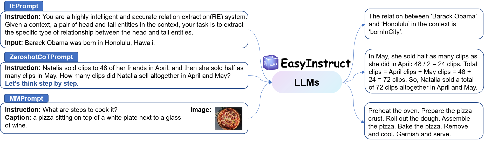

# Prompts

The `Prompts` module standardizes the instruction prompting step, where user requests are constructed as instruction prompts and sent to specific LLMs to obtain responses. You can choose the appropriate prompting method based on your specific needs.

<figure><figcaption></figcaption></figure>
